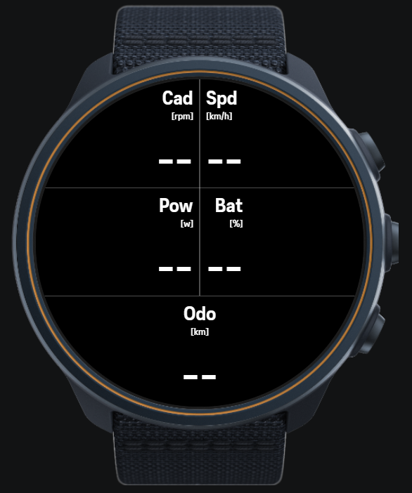

# BoschEBike Suunto App

SuuntoPlus (Zapp) app for Suunto watches that displays live data from a **Bosch eBike** via the [BoschEBike ESP32 Bridge](https://github.com/SellA/BoschEBikeESP32).

The app connects over BLE to the ESP32 bridge using the Bosch LDI service UUID and parses the protobuf payload directly on the watch.



## Displayed data

Live watch face (2×3 grid):

| Label | Unit | Description |
|---|---|---|
| Cad | rpm | Cadence |
| Spd | km/h | Speed |
| Pow | W | Motor power |
| Bat | % | Battery state of charge |
| Odo | km | Total odometer |

Post-workout summary screen:

| Field | Description |
|---|---|
| Max cadence | Peak cadence recorded during the exercise |
| Avg cadence | Average cadence over the exercise |
| Max power | Peak motor power recorded |
| Avg power | Average motor power over the exercise |

## Decoded but not displayed

These fields are decoded from the BLE payload and available as output fields,
but are not shown on the current watch face. They can be added to `t.html`
or used in a future layout:

| Output field | Protobuf field | Description |
|---|---|---|
| `charger` | 22 | Charger connected (0 = no, 1 = yes) |
| `light` | 17 | Bike light state (0 = off, 1 = on or auto) |

## Compatible Suunto watches

Any Suunto watch that supports **SuuntoPlus** (Zapp) apps:

| Watch | Notes |
|---|---|
| Suunto Vertical | Tested |
| Suunto Race / Race S | Compatible |
| Suunto 9 Peak Pro | Compatible |
| Suunto 5 Peak | Compatible |
| Suunto 9 Baro | Compatible |
| Suunto 9 (Gen 1) | Limited SuuntoPlus support |

## Requirements

- The **ESP32 bridge** must be running and connected to the bike (or in simulation mode). See [BoschEBikeESP32](https://github.com/SellA/BoschEBikeESP32).
- **Visual Studio Code** with the **SuuntoPlus Editor** extension installed.
- A Suunto watch that supports SuuntoPlus, paired via Bluetooth to the PC.

## Installation on the Suunto watch

SuuntoPlus apps are deployed from VS Code directly to the watch over Bluetooth using the **SuuntoPlus Editor** extension.

### 1. Install the SuuntoPlus Editor extension

Download and install the extension in VS Code:
[marketplace.visualstudio.com/items?itemName=Suunto.suuntoplus-editor](https://marketplace.visualstudio.com/items?itemName=Suunto.suuntoplus-editor)

### 2. Open the project

Open the `BoschEBikeSuunto` folder in VS Code. The SuuntoPlus Editor will detect the `manifest.json` and recognize it as a SuuntoPlus app.

### 3. Deploy to watch

> **Important:** disable syncing in the Suunto mobile app before deploying — if it syncs during development it will overwrite the test app on the watch.

1. Make sure the watch is paired via Bluetooth to the PC
2. Open the VS Code Command Palette (`Ctrl+Shift+P`)
3. Run **`SuuntoPlus: Deploy to Watch`**
4. Follow the on-screen prompts to confirm the installation on the watch

### Using during a workout

1. Start a new exercise on the watch
2. Swipe to the SuuntoPlus data screens
3. Select the **Bosch eBike** screen (first time only — it will be listed in the available apps)
4. The watch automatically scans for a BLE device advertising the LDI UUID and connects to the ESP32 bridge (`BoschEBike`)

## File overview

| File | Description |
|---|---|
| `main.js` | App logic: BLE state machine, protobuf parser, data output |
| `ext1.js` | BLE connection helper — connects to the LDI service UUID |
| `ext2.js` | BLE characteristic notification enable helper |
| `manifest.json` | App metadata (name, version, output field definitions) |
| `t.html` | Watch face template — 2×3 grid layout for circular display |
| `bosche01-*.dev` | Packaged app files ready to install (versioned) |

## How it works

```
Bosch eBike ──► ESP32 Bridge ──BLE LDI──► Suunto watch
                               UUID: 0000eb20-eaa2-11e9-81b4-2a2ae2dbcce4
```

1. The app calls `appConn.connect()` scanning for the LDI service UUID
2. Once connected, it enables notifications on the LDI characteristic (`0000eb21-...`)
3. On each notification, the raw protobuf payload is parsed (field IDs 1, 2, 5, 10, 12, 17, 22)
4. Decoded values are written to the output fields and displayed on screen

## Building a new `.dev` package

Use the SuuntoPlus Editor in VS Code:

1. Open the Command Palette (`Ctrl+Shift+P`)
2. Run **`SuuntoPlus: Build Sports App`**
3. The extension validates, minifies, and packages the sources into a `.dev` file

Fix any warnings reported before distributing.

## Related

- [BoschEBikeESP32](https://github.com/SellA/BoschEBikeESP32) — the ESP32 firmware that makes this app work
